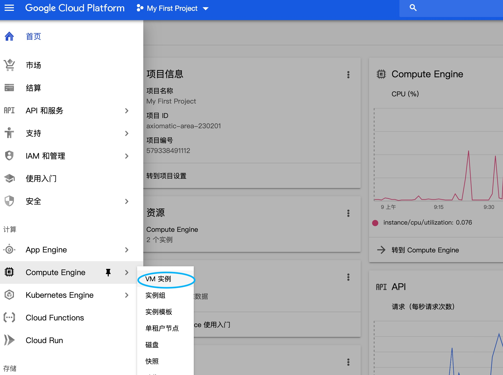
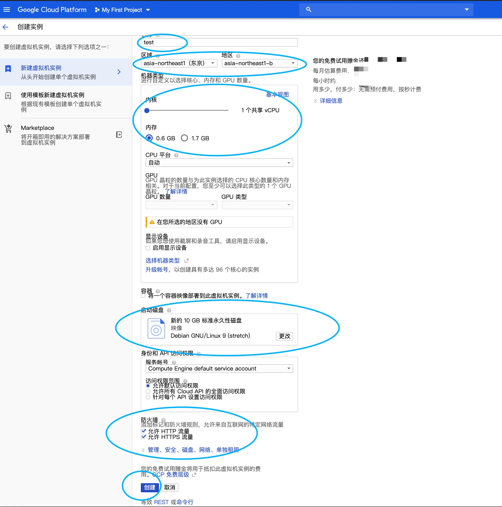
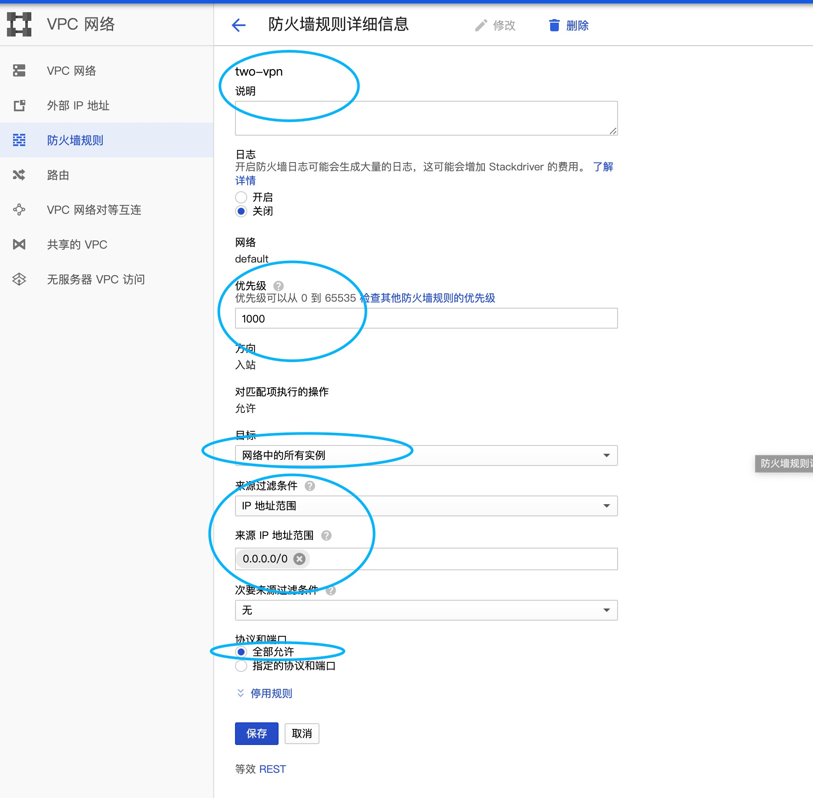
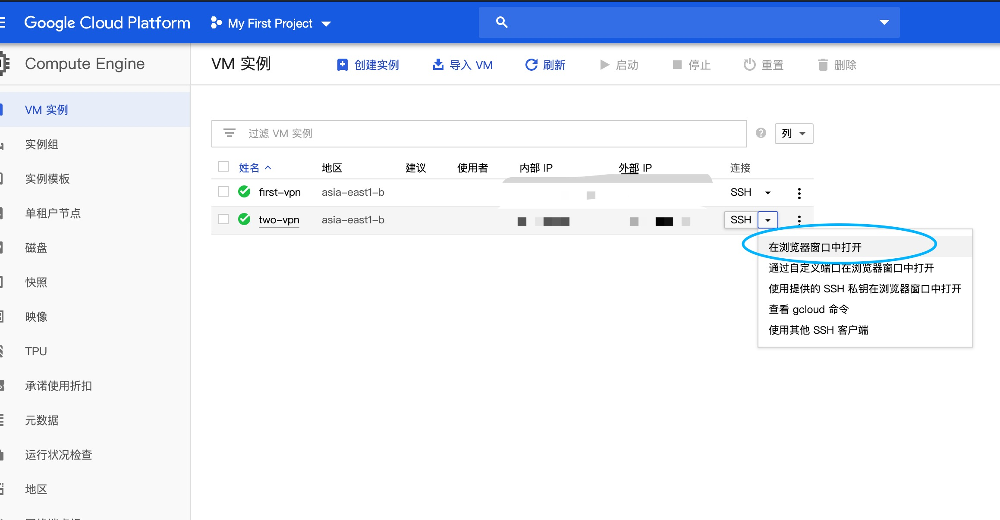

# Google云  vpn shadowsocks 翻墙


***用谷歌云搭建vpn shadowsocks 翻墙***

目录：
1. [前提条件](##前提条件) 
2. [创建VM实例](##一.创建VM实例)
3. [配置网络](##二.配置网络)
4. [安装shadowsocks](##三.安装shadowsocks)


[参考文档 allenking1028](https://github.com/allenking1028/ss/issues/1)

[参考视频 Youtobe BIGDONGDONG ](https://www.youtube.com/watch?v=xrbviAfagrU)


## 前提条件

1. 网络环境可以翻墙
2. 已经注册好谷歌云
3. 自己电脑已经会安装shadowsocks

## 一.创建VM实例



点击创建实例




 1. 随便取一个名字
 2. 选择距离自己近的区域和地区
 3. 配置最小内核  -省钱
 4. 磁盘Linux9
 5. 防火墙规则勾选
 6. 点击创建
  
## 二.配置网络

1. 网络 -> vpc网络 -> 防火墙规则

2. 创建防火墙规则



 1. 随便取一个名字
 2. 优先级
 3. 目标-所有实例
 4. ip地址范围
 5. 过滤条件0.0.0.0/0
 6. 协议和端口选择：全部允许
 7. 点击保存

## 三.安装shadowsocks

在浏览器中打开命令窗口


 1. 输入sudo -i    进入root模式
 2. ```wget -N --no-check-certificate https://raw.githubusercontent.com/FunctionClub/YankeeBBR/master/bbr.sh && bash bbr.sh install```
  * 蓝底窗口按TAB键选NO
  * 选择重启 Y
  * 后在界面随便按几个字母 便会提示重新连接。
 3. ```sudo -i```(最前面显示root@xxxx)
 4. ```bash bbr.sh start```
 5. ```wget --no-check-certificate https://raw.githubusercontent.com/teddysun/shadowsocks_install/master/shadowsocksR.sh && chmod +x shadowsocksR.sh```
 6. ```./shadowsocksR.sh```
 7. shadowsocks配置设置 
   * 密码
   * 输入端口号
   * 其他一路回车（也可自行选择混淆 协议）
   * 在最后出现红底数据以后
